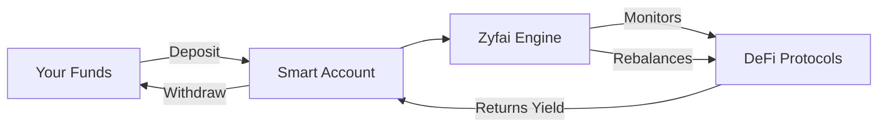

# Welcome to Zyfai

Zyfai is a DeFi Agent built to optimize DeFi yields with real-time data and automated on-chain actions.

## What is Zyfai?

Zyfai automates rebalancing across decentralized finance protocols through a non-custodial approach. From gathering information to taking action, it dynamically allocates liquidity across protocols and chains, maximizing your yields while you maintain full control of your funds.

### Key Features

- **Non-Custodial**: You maintain complete control of your funds at all times
- **Automated Rebalancing**: Smart algorithms monitor and rebalance your positions across protocols
- **Auto-Compound**: Enabled by default to maximize yield and capital efficiency
- **ERC-7579 Smart Accounts**: Customizable and secure smart account infrastructure
- **Smart Session Modules**: Granular control over automated actions
- **Multi-Chain Support**: Works seamlessly across Arbitrum, Base, and Plasma

## How It Works

1. **Deposit**: Transfer funds to your non-custodial smart account
2. **Monitor**: Zyfai continuously analyzes yield opportunities across protocols
3. **Optimize**: Automated rebalancing moves funds to the highest-performing positions
4. **Compound**: Earned yields are automatically reinvested to maximize returns
5. **Withdraw**: Access your funds anytime with full control

## Why Choose Zyfai?

### Customization & Control
Unlike centralized vault managers seeking high performance fees, Zyfai prioritizes customization and control. You decide the risk level, protocols, and strategies.

### Automated Efficiency
Manual yield farming requires constant monitoring and frequent transactions. Zyfai handles this automatically, saving you time and gas costs.

### Security First
- Non-custodial architecture means you always control your funds
- ERC-7579 compliant smart accounts
- Regular security audits
- Open-source SDK for transparency

## Supported Chains & Protocols

### Chains
- **Arbitrum** (Chain ID: 42161)
- **Base** (Chain ID: 8453)
- **Plasma** (Chain ID: 9745)

### Protocols
Zyfai integrates with leading DeFi protocols to provide the best yield opportunities. View the complete list in [Available Protocols](/docs/protocols).

## Getting Started

Ready to start optimizing your DeFi yields? Here's how:

1. **[Install the SDK](/docs/quickstart)** - Set up the Zyfai SDK in your project
2. **[Deploy Your Smart Account](/docs/smart-accounts)** - Create your non-custodial smart wallet
3. **[Make Your First Deposit](/docs/depositing-funds)** - Fund your account and start earning
4. **[Monitor Performance](/docs/analytics)** - Track your earnings and APY

## Security & Risks

### Security Measures
- Non-custodial smart contracts
- No platform access to user funds
- Transparent, open-source code
- Regular security audits

### Important Considerations
- Smart contract risk exists with all DeFi protocols
- Gas costs apply for rebalancing transactions
- Past performance doesn't guarantee future results
- Always understand the protocols your funds are allocated to

## Community & Support

- **Documentation**: You're reading it!
- **GitHub**: [github.com/ondefy/zyfai-sdk](https://github.com/ondefy/zyfai-sdk)
- **Discord**: Join our community
- **Twitter**: Follow [@Zyfai](https://twitter.com/Zyfai)
- **Telegram**: Get support

---

Ready to dive deeper? Check out our [Quick Start Guide](/docs/quickstart) or explore the [SDK Documentation](/docs/sdk-reference).
